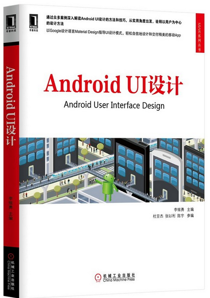
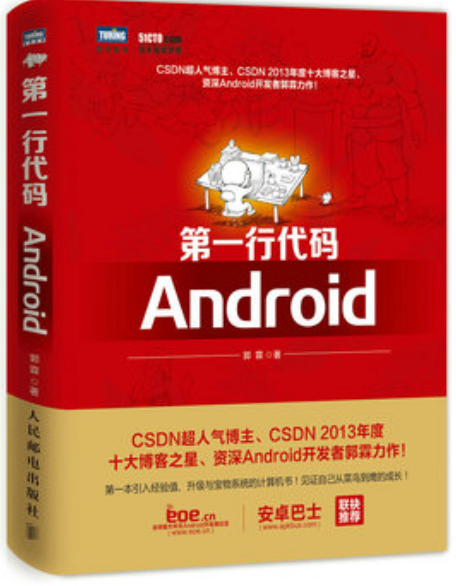
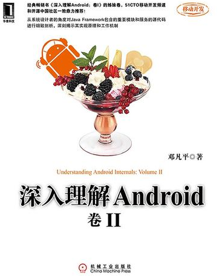
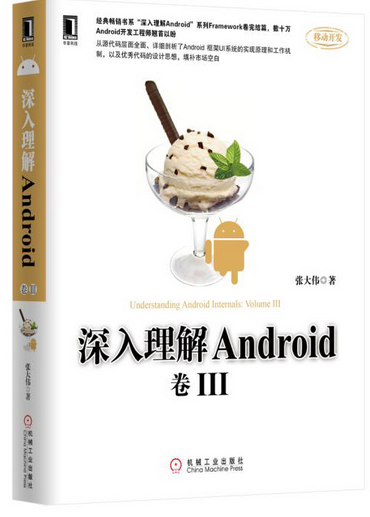
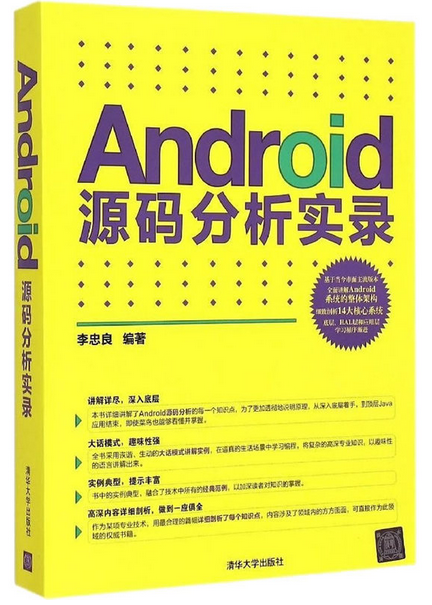
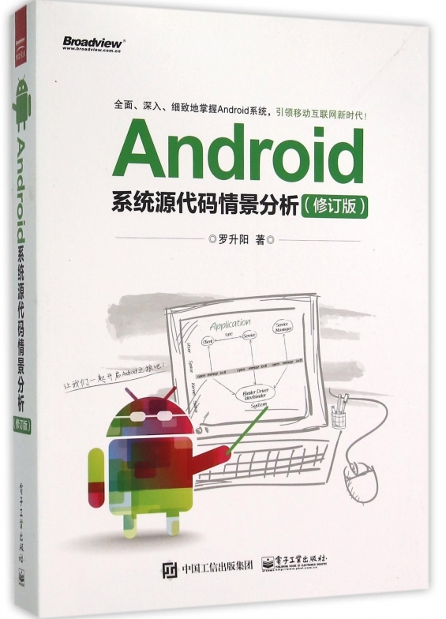
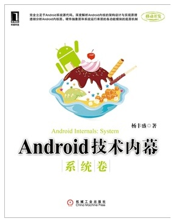
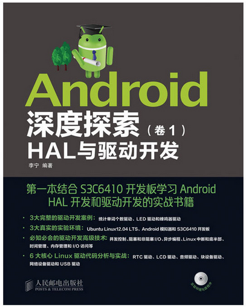
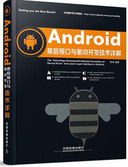
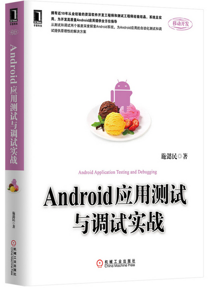

# 实验室Android开发书籍清单

## 1. << Android UI设计>>
李维勇（主编）　　机械工业出版社
  
      
       
## 2. << 第一行代码Android>>
郭 霖(著)  人民邮电出版社
   
     
     
## 3. << 深入理解Android II >>
邓凡平（著）　　机械工业出版社
    
       
      
## 4. << 深入理解Android III >>
张大伟（著）　　机械工业出版社
    
      
      
## 5. << Android 源代码分析实录 >>
李忠良（著）　　清华大学出版社
      
     
      
## 6. << Android系统源代码情景分析（修订版）>>
罗升阳(著)  人民邮电出版社
       
      
     
## 7. << Android技术内幕（系统卷）>>
杨丰盛(著)  　机械工业出版社
      
     
     
## 8. << Android深度探索HAL与驱动开发（卷１）>>
李宁(著)  人民邮电出版社
      
      
     
## 9. << Android底层接口与驱动开发技术详解>>
陈强（著）　　中国铁道出版社
      
      
      
## 10. << Android应用测试与调试实战>>
施懿民（著）　　机械工业出版社
      
